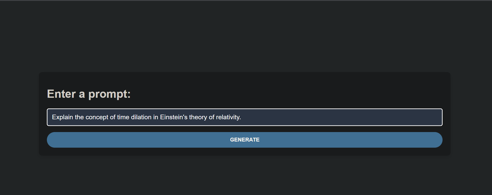
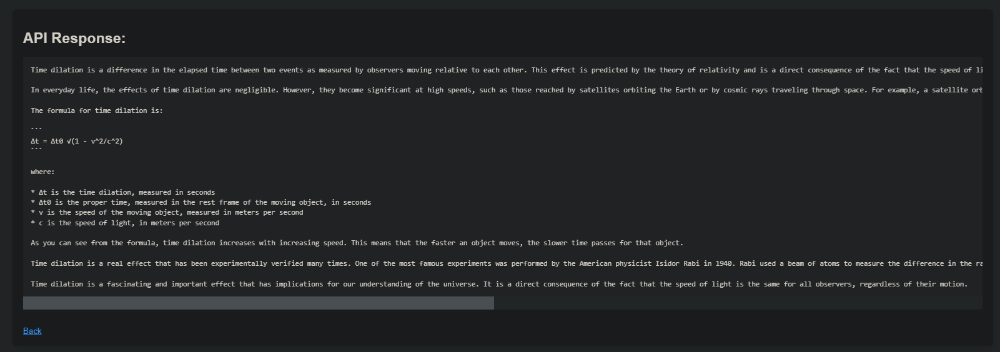

<div align="center">

# PaLM API: Text Quickstart with Node.js

🤖 PaLM API: Text Quickstart with Node.js is a simple web application built with Node.js and Express that uses Google's PaLM API to generate text based on a user-provided prompt.

[](https://img.shields.io/badge/Built%20with-%E2%9D%A4%EF%B8%8F-red)
[](https://nodejs.org/)
[](https://expressjs.com/)
[](https://developers.generativeai.google/tutorials/text_node_quickstart)


## 🚀 Installation

1. Clone this repository:

```
git clone https://github.com/ElonMusk2002/PaLM-quickstart.git
```

2. Install the dependencies by running the following command in your project directory:

```
npm install
```
3. Rename `.env.example` to `.env` and replace `Your_API_Key` with your actual Google's PaLM API Key.

4. Run the application:

```
node app.js
```

The application will be served on `http://localhost:3000` by default.

## Dependencies

[](https://github.com/googleapis/nodejs-ai-platform-samples/tree/master/samples/gapic/generative_language)
[](https://www.npmjs.com/package/body-parser)
[](https://www.npmjs.com/package/dotenv)
[](https://ejs.co/)
[](https://expressjs.com/)
[](https://www.npmjs.com/package/google-auth-library)


## 💻 Usage 

After the server starts, you can navigate to `http://localhost:3000` in your web browser. 

You will be greeted with a simple form where you can enter a text. After you submit the form, the application will communicate with Google's PaLM API and display the result of the generated text.

Please note that the API may take a few seconds to generate the text, so be patient!

## 📷 Demo Screenshots





## 📖 API Reference

- [Google's PaLM API Tutorial](https://developers.generativeai.google/tutorials/text_node_quickstart)
- [Get your Google's PaLM API key](https://makersuite.google.com/app/apikey)

## 📄 License

[MIT License](LICENSE)
</div>
